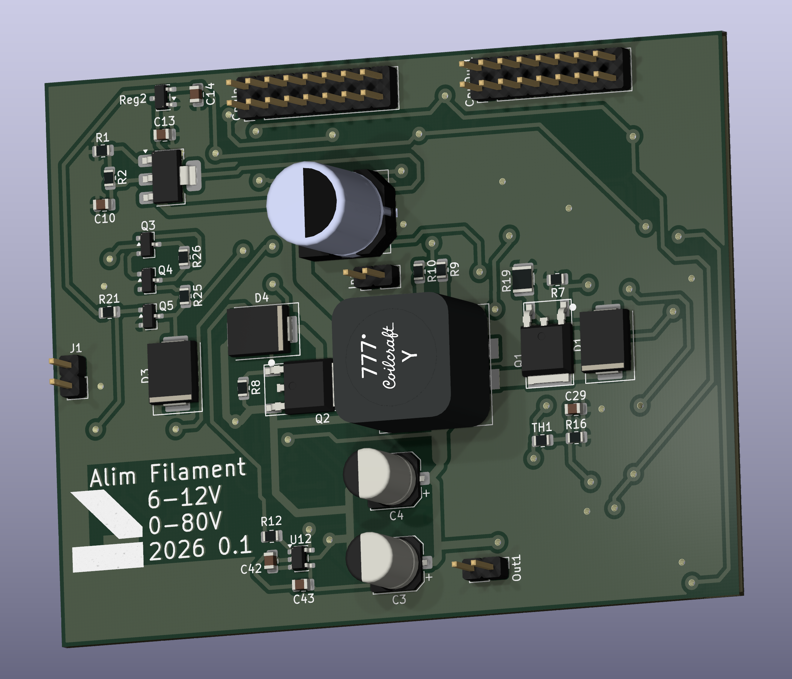
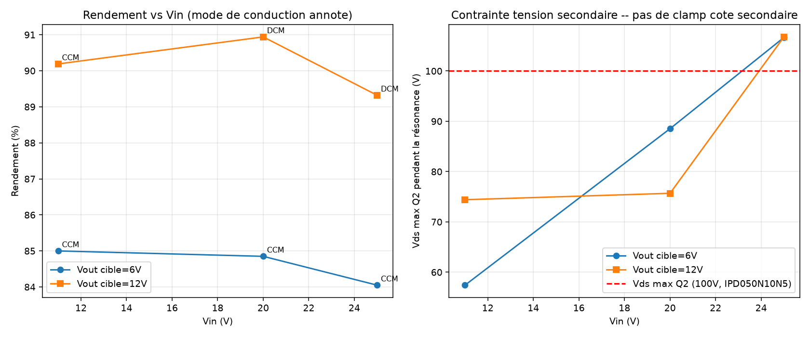
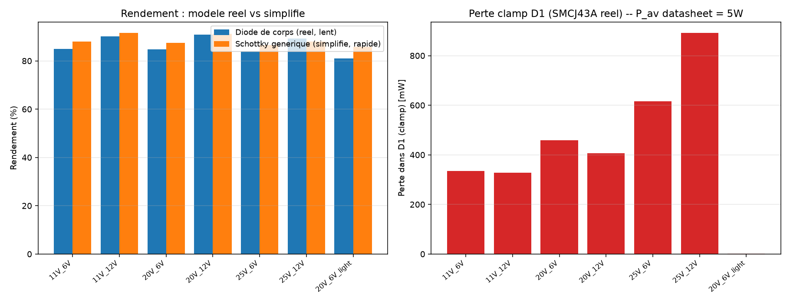
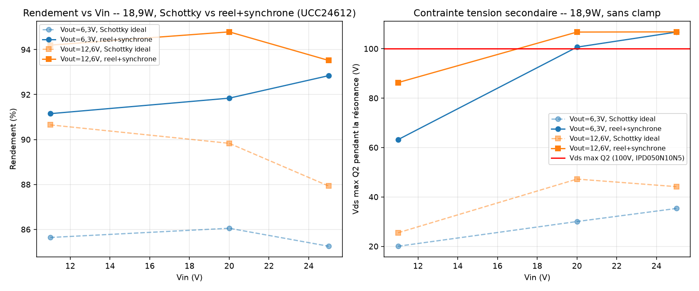
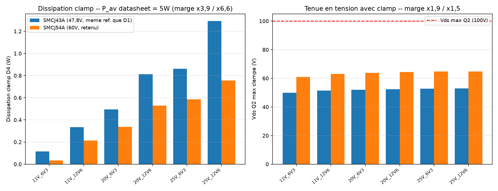

# KICAD-C2000-float-flyback

Alimentation flyback isolée et flottante pour le chauffage d'un filament de
tube à vide et un étage de préamplification bas bruit, conçue sous KiCad 10.

Convertisseur flyback 200kHz, 11-25V en entrée → 5,5-13V/3A en sortie.
Secondaire entièrement flottant, élevable de 0 à 90V par un pont symétrique
2×100kΩ (une résistance vers Vout+, une vers Vout-) — pour réduire le stress
cathode/chauffage sur un préamplificateur à tubes bas bruit (montage cascode).

<p align="center">
  
</p>

---

## Le point de conception le plus notable

Le redressement synchrone secondaire (Q2) est piloté par un **UCC24612**, pas
par le C2000 : ce contrôleur détecte directement le Vds de Q2 (diode
emulation) et pilote sa grille tout seul — aucun signal PWM ni isolateur
dédié à faire traverser la barrière pour ce canal. Avant ça, la commande
passait par un ISO7710+UCC27517 secondaires pilotés en PWM depuis le C2000 :
un timing fixé par le firmware, « à l'aveugle », sans retour sur le vrai Vds
de Q2 — remplacé une fois ce défaut identifié. L'UCC24612 est alimenté
directement depuis Vout (VDD dans sa plage 4,5-28V, pas de bootstrap
nécessaire) ; côté primaire, l'isolation PWM/EN (ISO7710 + UCC27517 + DPC817)
reste inchangée.

Chaque composant de puissance (MOSFETs, clamp, condensateurs d'entrée et de
sortie) est sourcé avec sa propre fiche datasheet dans
[`composants-datasheets/data/carte-flyback/`](../composants-datasheets/data/carte-flyback)
— page citée, base (absolue / recommandée / typique / calculée), jamais de
valeur choisie à l'oeil. Ce sourcing a d'ailleurs fait revenir deux fois sur
le choix de Cin et Cout : le premier calcul prenait le coin 13V/3A (39W)
comme pire cas, avant d'être recorrigé sur les vrais coins d'usage — deux
câblages de filament qui tombent à **la même puissance réelle** (18,9W) et
divisent par deux la contrainte de courant et d'ondulation retenue au départ.
Le détail (formules, marges, historique des choix) est dans
[`00-intention-conception.md`](00-intention-conception.md).

---

## Architecture

| Bloc | Rôle |
|---|---|
| Primaire | Cin, MOSFET N (TO-252), clamp TVS D1 (boîtier SMC), UCC27517 + ISO7710 (PWM) |
| Isolation | ISO7710 (PWM primaire) + DPC817 (EN) — plus de canal PWM dédié au secondaire |
| Secondaire (flottant) | MOSFET N potentiel bas (rectification synchrone), UCC24612 (détection Vds, alimenté direct depuis Vout) + clamp TVS D4, banc Cout, pont bias 2×100kΩ |
| Couplage | Coilcraft MSD1514, 1:1 (k≈0,99), 10µH par enroulement |

L'isolation fonctionnelle est dimensionnée pour l'écart réel présent sur la
carte (~100V avec le bias), pas pour la tenue diélectrique complète des
isolateurs (5000V) — pas de slot d'isolation dans le PCB.

---

## Le schéma est généré, les feuilles sont ensuite routées à la main

```
00-intention-conception.md      source de vérité (calculs, marges, sourcing)
        │
        ├── gen_symboles.py        → lib/custom_parts.kicad_sym
        │                            (UCC27517, ISO7710, MSD1514, MOSFET 3 broches)
        │
        └── gen_composants.py      → alim.kicad_sch / flyback.kicad_sch /
              ▲                       isolation.kicad_sch (feuilles hiérarchiques)
              │                       kicad_gen.py — primitives communes
        étiquettes globales uniquement, aucun fil posé par script
```

Une fois qu'une feuille a été reprise à la main dans KiCad (repositionnement
des composants, rotation, déplacement des étiquettes Référence/Valeur), elle
devient un **fichier de travail permanent** : les générateurs ne sont plus
rejoués dessus.

ERC sur la hiérarchie complète des 3 feuilles : 0 erreur. Empreintes custom
(`lib_fp/*.pretty/`) pour l'inductance couplée MSD1514, le MOSFET TO-252 et le
condensateur KEMET A786MW (V-chip), toutes construites à partir des cotes
mécaniques des datasheets plutôt que d'une empreinte générique approximative.

Placement et routage du PCB restent manuels, comme pour les autres cartes de
ce workspace.

---

## Validation — simulation et mesure

| Étape                       | État                                   |
| --------------------------- | --------------------------------------- |
| Calcul analytique           | fait — [`00-intention-conception.md`](00-intention-conception.md) |
| Simulation LTspice (diode, 10W)       | étapes 1-4 faites, modèles réels (MOSFET Infineon, clamp D1) |
| Simulation LTspice (18,9W, synchrone) | faite — proxy UCC24612, clamp secondaire dimensionné |
| Redressement synchrone (KiCad)        | implémenté — UCC24612 (U12) + clamp D4 |
| Prototype                   | à fabriquer                            |
| Mesures au banc             | à faire                                |

Balayage à Vin=11/20/25V, 6V et 12V à 10W (+ un point à charge légère) :
rendement 84-91%, et la tension drain de Q2 dépasse déjà 100V (sa tenue
en tension) à Vin≥23V environ, sans clamp secondaire modélisé à ce
stade.

<p align="center">
  
</p>

Autre résultat notable : la plupart des points réels fonctionnent en
**CCM**, pas en DCM comme une estimation rapide l'avait d'abord suggéré —
déterminé sur la forme d'onde (passage par zéro de I(L2)), pas supposé.
Comparé à un modèle Schottky générique simplifié (rapide mais pas le
composant réel) pour chiffrer la perte dans le clamp D1 :

<p align="center">
  
</p>

Rejoué à la cible réelle (**18,9W**) avec un proxy de redressement
synchrone : le dépassement empire (dès Vin=20V, jusqu'à 106,8V) —
indépendant du redresseur, c'est une résonance de l'inductance de fuite.
Le passage en synchrone (UCC24612) apporte jusqu'à +5 points de
rendement, mais ne corrige pas la surtension :

<p align="center">
  
</p>

D'où le clamp secondaire **D4 (SMCJ54A)**, qui ramène Vds_Q2 à 61-65V
(marge ×1,5) pour 0,03-0,76W de dissipation (marge ×6,6 vs les 5W du
composant) — comparé au SMCJ43A (même réf. que D1, déjà au BOM) qui tient
aussi mais coûte jusqu'à 2 points de rendement de plus :

<p align="center">
  
</p>

Le détail, le protocole de mesure et le tableau calcul / simulation /
mesure : [`doc/sim-vs-mesure.md`](doc/sim-vs-mesure.md) (§7/§7bis pour le
passage 18,9W) ; l'implémentation KiCad correspondante :
[`00-intention-conception.md`](00-intention-conception.md) §16.

---

## Licence

CERN-OHL-S v2 — voir [`LICENSE`](LICENSE).
