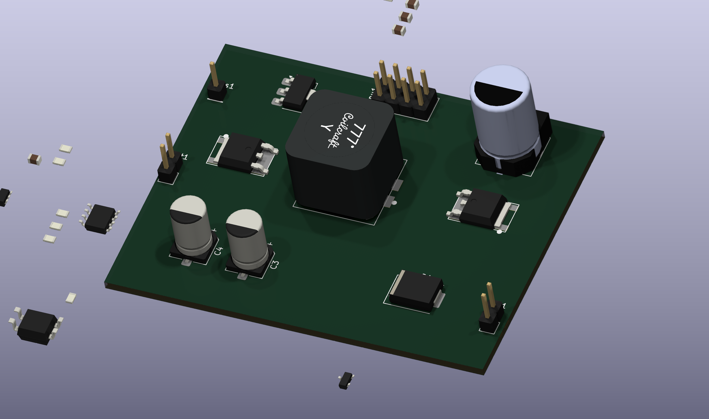

# KICAD-C2000-float-flyback

Alimentation flyback isolée et flottante pour le chauffage d'un filament de
tube à vide et un étage de préamplification bas bruit, conçue sous KiCad 10.

Convertisseur flyback 200kHz, 11-25V en entrée → 5,5-13V/3A en sortie.
Secondaire entièrement flottant, élevable de 0 à 90V par un pont symétrique
2×100kΩ (une résistance vers Vout+, une vers Vout-) — pour réduire le stress
cathode/chauffage sur un préamplificateur à tubes bas bruit (ùontage cascode).

<p align="center">
  
</p>

---

## Le point de conception le plus notable

L'isolation primaire/secondaire passe par deux ISO7710 (un par traversée de
signal : PWM primaire, PWM secondaire) et un DPC817 (EN), chacun associé à un
UCC27517 monté en inverseur — l'un pilote le MOSFET primaire, l'autre la
rectification synchrone côté potentiel bas. Le secondaire flottant ne reçoit
**aucune alimentation dédiée** : il démarre en bootstrap via la diode de
corps du MOSFET secondaire, et les drivers/isolateurs secondaires ne prennent
le relais qu'une fois Vout monté au-dessus du seuil UVLO de l'UCC27517.

Chaque composant de puissance (MOSFETs, clamp, condensateurs d'entrée et de
sortie) est sourcé avec sa propre fiche datasheet dans
[`composants-datasheets/data/carte-flyback/`](../composants-datasheets/data/carte-flyback)
— page citée, base (absolue / recommandée / typique / calculée), jamais de
valeur choisie à l'oeil. Ce sourcing a d'ailleurs fait revenir deux fois sur
le choix de Cin et Cout : le premier calcul prenait le coin 13V/3A (39W)
comme pire cas, avant d'être recorrigé sur les vrais coins d'usage — deux
câblages de filament qui tombent à **la même puissance réelle** (18,9W) et
divisent par deux la contrainte de courant et d'ondulation retenue au départ.
Le détail (formules, marges, historique des choix) est dans
[`00-intention-conception.md`](00-intention-conception.md).

---

## Architecture

| Bloc | Rôle |
|---|---|
| Primaire | Cin, MOSFET N (TO-252), clamp TVS (boîtier SMC), UCC27517 + ISO7710 (PWM) |
| Isolation | ISO7710 ×2 (PWM primaire, PWM secondaire) + DPC817 (EN) |
| Secondaire (flottant) | MOSFET N potentiel bas (rectification synchrone), UCC27517 auto-alimenté par bootstrap, banc Cout, pont bias 2×100kΩ |
| Couplage | Coilcraft MSD1514, 1:1 (k≈0,99), 10µH par enroulement |

L'isolation fonctionnelle est dimensionnée pour l'écart réel présent sur la
carte (~100V avec le bias), pas pour la tenue diélectrique complète des
isolateurs (5000V) — pas de slot d'isolation dans le PCB.

---

## Le schéma est généré, les feuilles sont ensuite routées à la main

```
00-intention-conception.md      source de vérité (calculs, marges, sourcing)
        │
        ├── gen_symboles.py        → lib/custom_parts.kicad_sym
        │                            (UCC27517, ISO7710, MSD1514, MOSFET 3 broches)
        │
        └── gen_composants.py      → alim.kicad_sch / flyback.kicad_sch /
              ▲                       isolation.kicad_sch (feuilles hiérarchiques)
              │                       kicad_gen.py — primitives communes
        étiquettes globales uniquement, aucun fil posé par script
```

Une fois qu'une feuille a été reprise à la main dans KiCad (repositionnement
des composants, rotation, déplacement des étiquettes Référence/Valeur), elle
devient un **fichier de travail permanent** : les générateurs ne sont plus
rejoués dessus.

ERC sur la hiérarchie complète des 3 feuilles : 0 erreur. Empreintes custom
(`lib_fp/*.pretty/`) pour l'inductance couplée MSD1514, le MOSFET TO-252 et le
condensateur KEMET A786MW (V-chip), toutes construites à partir des cotes
mécaniques des datasheets plutôt que d'une empreinte générique approximative.

Placement et routage du PCB restent manuels, comme pour les autres cartes de
ce workspace.

---

## Licence

CERN-OHL-S v2 — voir [`LICENSE`](LICENSE).
